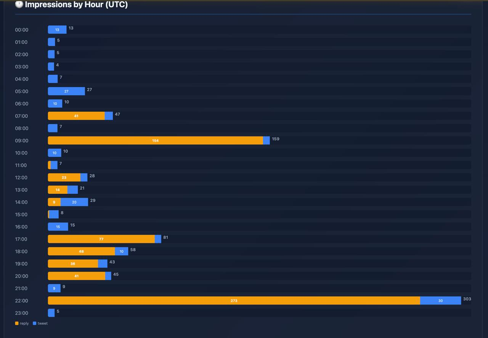

# CypherPulse

[](https://tibor-ai.github.io/cypherpulse/)


**Open-source X/Twitter analytics dashboard that tracks your tweet performance over time.**

CypherPulse automatically collects engagement metrics at 24h, 72h, and 7-day intervals after posting, giving you deep insights into what content resonates with your audience.

## ✨ Features

- 📊 **Automated Metrics Collection** — Snapshots at 24h, 72h, and 7 days after posting
- 📈 **Performance Analytics** — Track engagement by post type (tweets, replies, retweets)
- ⏰ **Timing Insights** — Discover your best hours and days to post
- 🎯 **Top Posts Tracking** — See which content performs best
- 🌐 **Beautiful Dashboard** — Dark-themed, responsive web interface
- 🔧 **Simple CLI** — Scan, collect, and report from the command line

## 🚀 Quick Start

### ⚡ Quick Install

**Ubuntu / macOS:**
```bash
curl -fsSL https://raw.githubusercontent.com/tibor-ai/cypherpulse/main/install.sh | bash
```

**Windows (PowerShell as Administrator):**
```powershell
irm https://raw.githubusercontent.com/tibor-ai/cypherpulse/main/install.ps1 | iex
```

**Tested on:** Ubuntu 22.04+, macOS 13+, Windows 11

---

## ⏰ Automated Scheduling

CypherPulse works best when it collects data automatically. The install scripts offer to set this up for you, but you can also configure it manually.

### Why automate?

- **Consistent tracking** — Never miss a snapshot window (24h, 72h, 7d)
- **Better insights** — Regular collection builds a complete performance history
- **Set and forget** — No need to remember to run `collect` manually

**Recommended frequency:**
- **Hourly** — Best for active accounts (10+ tweets/day)
- **Daily** — Perfect for most users (1-5 tweets/day)

### Automatic Setup (During Install)

Both install scripts will prompt you to set up automated collection:

- **Linux/macOS** — Adds a cron job
- **Windows** — Creates a Windows Task Scheduler task

Just say "yes" during installation and choose your preferred frequency.

### Manual Setup

If you skipped automatic setup or want to change the schedule later:

#### Linux / macOS (crontab)

```bash
# Open crontab editor
crontab -e

# Add one of these lines:

# Hourly (for active accounts)
0 * * * * cd ~/cypherpulse && source venv/bin/activate && cypherpulse scan && cypherpulse collect

# Daily at 9 AM (recommended for most users)
0 9 * * * cd ~/cypherpulse && source venv/bin/activate && cypherpulse scan && cypherpulse collect

# Every 6 hours
0 */6 * * * cd ~/cypherpulse && source venv/bin/activate && cypherpulse scan && cypherpulse collect
```

#### Windows (Task Scheduler)

**Option 1: PowerShell (Recommended)**

Run this in PowerShell as Administrator:

```powershell
$action = New-ScheduledTaskAction -Execute "powershell.exe" `
  -Argument "-WindowStyle Hidden -Command `"cd $env:USERPROFILE\cypherpulse; .\venv\Scripts\activate; cypherpulse scan; cypherpulse collect`""

# Daily at 9 AM
$trigger = New-ScheduledTaskTrigger -Daily -At "9:00AM"

# OR for hourly:
# $trigger = New-ScheduledTaskTrigger -Once -At "9:00AM" -RepetitionInterval (New-TimeSpan -Hours 1) -RepetitionDuration ([TimeSpan]::MaxValue)

Register-ScheduledTask -TaskName "CypherPulse" -Action $action -Trigger $trigger -Force
```

**Option 2: Command Line (schtasks)**

```cmd
REM Daily at 9 AM
schtasks /create /tn "CypherPulse" /tr "powershell.exe -WindowStyle Hidden -Command \"cd %USERPROFILE%\cypherpulse; .\venv\Scripts\activate; cypherpulse scan; cypherpulse collect\"" /sc daily /st 09:00 /f

REM Hourly
schtasks /create /tn "CypherPulse" /tr "powershell.exe -WindowStyle Hidden -Command \"cd %USERPROFILE%\cypherpulse; .\venv\Scripts\activate; cypherpulse scan; cypherpulse collect\"" /sc hourly /f
```

### What Gets Automated?

The scheduled task runs two commands:

1. **`cypherpulse scan`** — Discovers new tweets from your account
2. **`cypherpulse collect`** — Takes snapshots of tweets that are due (24h, 72h, 7d after posting)

**Note:** The web dashboard (`cypherpulse serve`) is NOT automated — run it manually when you want to view your analytics.

### Verify It's Working

**Linux/macOS:**
```bash
# List your cron jobs
crontab -l

# Check if cron service is running
sudo systemctl status cron  # or 'crond' on some systems
```

**Windows:**
```powershell
# List scheduled tasks
Get-ScheduledTask -TaskName "CypherPulse"

# View task details
Get-ScheduledTaskInfo -TaskName "CypherPulse"
```

---

### 📦 Manual Installation

<details>
<summary>Click to expand manual installation steps</summary>

```bash
# Clone the repository
git clone https://github.com/tibor-ai/cypherpulse.git
cd cypherpulse

# Install dependencies
pip install -r requirements.txt

# Or install as a package
pip install -e .
```

</details>

### Configuration

Create a `.env` file in the project root:

```bash
TWITTER_API_KEY=your_twitterapi_io_key_here
TWITTER_USERNAME=your_twitter_username
PORT=8080
```

**API Key**: Get your free API key from [twitterapi.io](https://twitterapi.io/?ref=quenosai)

*(Using this link helps support the project — thank you! 🙏)*

### Usage

```bash
# Scan for new tweets
cypherpulse scan

# Collect metric snapshots (run daily)
cypherpulse collect

# View analytics report in terminal
cypherpulse report

# Start web dashboard
cypherpulse serve
```

Then open your browser to `http://localhost:8080`

## 📸 Screenshots

### Impressions by Hour (UTC) — stacked by post type


## 💡 Why CypherPulse?

- **Time-series tracking** — Most analytics tools only show current stats. CypherPulse tracks how engagement evolves over days.
- **Post type analysis** — Understand whether tweets, replies, or retweets perform better for your account.
- **Timing optimization** — Data-driven insights on when your audience is most engaged.

## 📋 How It Works

1. **Scan** — CypherPulse fetches your recent tweets via the Twitter API
2. **Track** — It registers each tweet and schedules metric collection at 24h, 72h, and 7d
3. **Analyze** — Visualize trends, compare post types, and optimize your content strategy

All data is stored locally in a SQLite database (`~/.cypherpulse/analytics.db`)

## 🛠️ Tech Stack

- **Python 3.8+** — Core application
- **FastAPI** — REST API and dashboard backend
- **SQLite** — Local data storage
- **Vanilla JS** — No heavy frontend frameworks, just clean, fast code

## 📦 Project Structure

```
cypherpulse/
├── cypherpulse/
│   ├── __init__.py
│   ├── collector.py    # Tweet scanning and metrics collection
│   ├── db.py           # Database operations
│   ├── api.py          # FastAPI backend
│   └── cli.py          # Command-line interface
├── web/
│   └── index.html      # Dashboard UI
├── requirements.txt
├── setup.py
└── README.md
```

## 🤝 Contributing

Contributions are welcome! Please feel free to submit a Pull Request.

## 📄 License

MIT License - see [LICENSE](LICENSE) file for details

## 🙏 Acknowledgments

Built with love for the Twitter developer community. Data provided by [twitterapi.io](https://twitterapi.io/?ref=quenosai).

---

**Made with ⚡ by the open-source community**
